# Awesome-cloth(Welcome any contribution!!)

## Reflection Symmetry in Textured Sewing Patterns

## Interactive Design of Periodic Yarn-Level Cloth Patterns

## Sackcloth or Silk? The Impact of Appearance vs Dynamics on the Perception of Animated Cloth

## DeepGarment : 3D Garment Shape Estimation from a Single Image

## Implicit Untangling: A robust solution for modeling layered clothing(SIGGRAPH 2019)

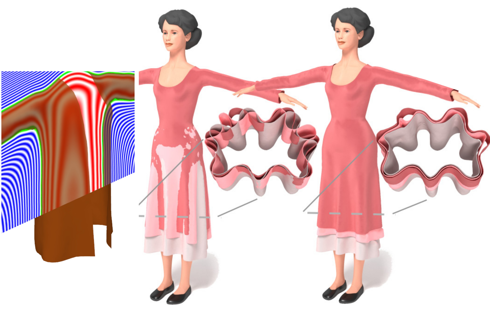

## Wallpaper Pattern Alignment along Garment Seams(SIGGRAPH 2019)
[[project](https://igl.ethz.ch/projects/aligned-seams)
[[paper](https://igl.ethz.ch/projects/aligned-seams/Aligned-Seams-2019.pdf)
[[video](https://youtu.be/ZhQUQ-xY8MM)]

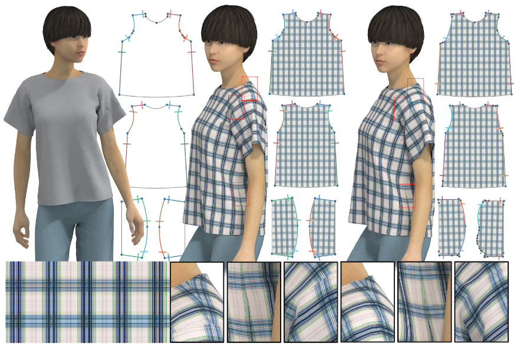

## Visual Knitting Machine Programming(SIGGRAPH 2019)
[[project](https://textiles-lab.github.io/publications/2019-visualknit)]
[[paper](https://drive.google.com/file/d/1NtVuCF8oBdFLd0aQb4-VYmk5z1Aq4tYP)]
[[video](https://drive.google.com/file/d/1WwRQp_MOyE6Ek0I3kj4WT6GGdn4tnEmE)]
[[code](https://drive.google.com/file/d/1eDWzSngvJCB65TpwRn89Uc-0YEGE8oz4)]

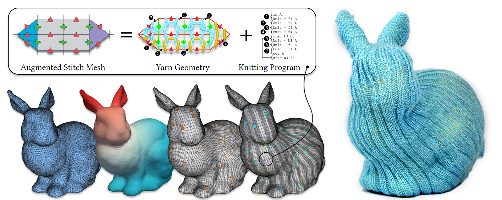

## Digital Fabrication of Soft Actuated Objects by Machine Knitting(CHI 2019)
[[project](https://morphingmatter.cs.cmu.edu/machine-knitting-soft-actuation)]
[[paper](http://morphingmatter.cs.cmu.edu/~morphin5/wp-content/uploads/2019/04/soft_actuated_objects.pdf)]
[[video](https://vimeo.com/333664948)]

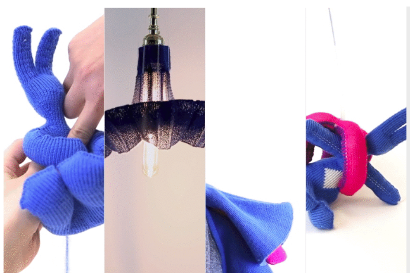

## Efficient Transfer Planning for Flat Knitting(ACM Symposium on Computation Fabrication 2018)
[[project](https://textiles-lab.github.io/publications/2018-flat-xfer-plan)]
[[paper](https://drive.google.com/file/d/18vG0r9QOS3atL5PABGysdzCMV7xKoKVi)]

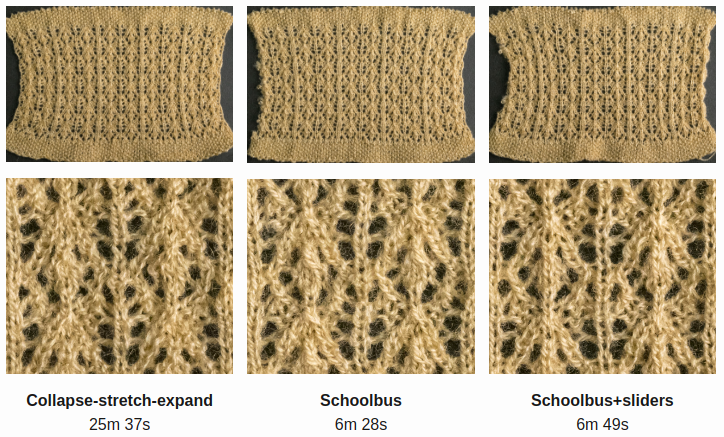

## Automatic Machine Knitting of 3D Meshes(TOG 2018)
[[project](https://textiles-lab.github.io/publications/2018-autoknit)]
[[paper](https://drive.google.com/file/d/1UO0aGgbZqidvzgupqrJ--GwazSmIkph2)]
[[video](https://drive.google.com/file/d/1_XlprMZKhhuk89xsZMMo7Qxv801bRASK)]
[[code](https://github.com/textiles-lab/autoknit)]

## A Compiler for 3D Machine Knitting(SIGGRAPH 2016)
[[project](https://studios.disneyresearch.com/publication/machine-knitting-compiler)]
[[paper](https://s3-us-west-1.amazonaws.com/disneyresearch/wp-content/uploads/20160705213118/A-Compiler-for-3D-Machine-Knitting-Paper.pdf)]
[[video](https://www.youtube.com/watch?v=D-kpy44tB4M)]

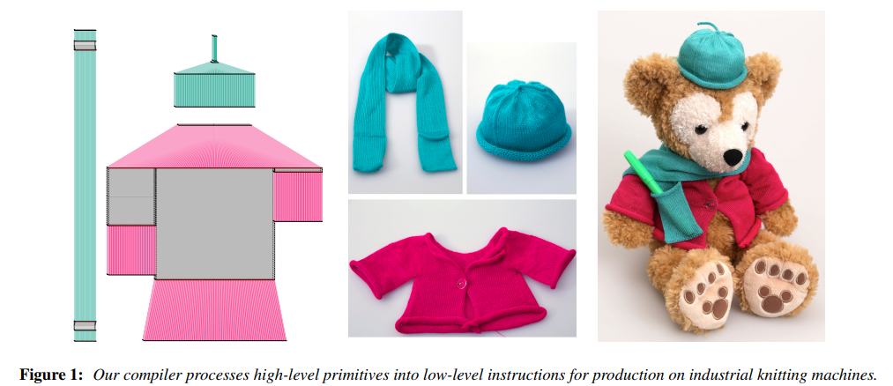

## Woven Fabric Model Creation from a Single Image(TOG 2017)
[[paper](http://www.pismosoftware.co.uk/mashhuda/res/papers/TOG17_preprint.pdf)]

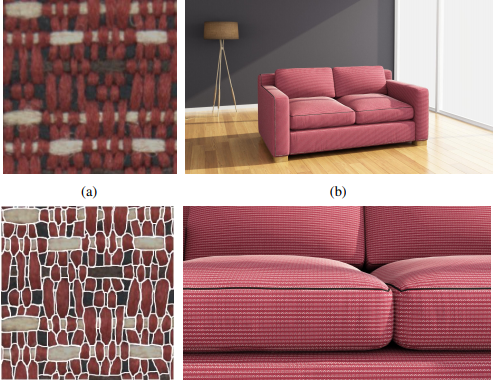

## Knittable Stitch Meshes(SIGGRAPH 2019)
[[project](http://www.cs.utah.edu/~kwu/stitchmodeling#knittable)]
[[paper](http://www.cs.utah.edu/~kwu/knittable/knittable.pdf)]
[[video](https://www.youtube.com/watch?v=9jcoREh70Bg&feature=youtu.be)]

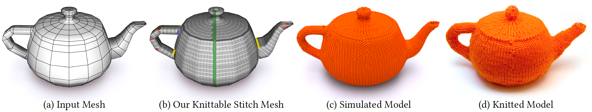

## Stitch Meshing(SIGGRAPH 2018)
[[project](http://www.cs.utah.edu/~kwu/stitchmodeling#knittable)]
[[paper](http://www.cs.utah.edu/~kwu/stitchmeshing/stitch_meshing_final.pdf)]
[[video](http://www.cs.utah.edu/~kwu/stitchmeshing/StitchMeshRotations.mp4)]
[[code](https://github.com/kuiwuchn/stitchMeshing)]

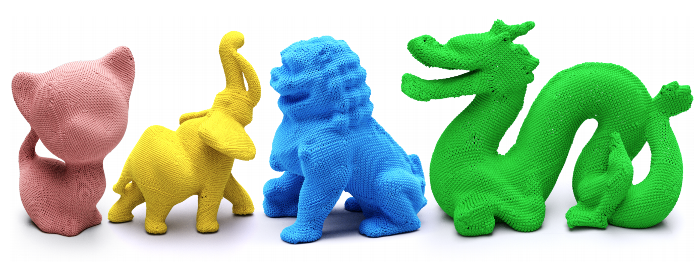

## Real-time Cloth Rendering with Fiber-level Detail(TVCG 2017)
[[project](http://www.cs.utah.edu/~kwu/rtfr.html#rtcr)]
[[paper](http://www.cs.utah.edu/~kwu/RTFR/rtcr_lores.pdf)]
[[video](https://youtu.be/JPsA3pGYHFQ)]

## Real-time Fiber-level Cloth Rendering(I3D 2017)
[[project](http://www.cs.utah.edu/~kwu/rtfr.html#rtcr)]
[[paper](http://www.cs.utah.edu/~kwu/RTFR/rtfr.pdf)]
[[video](https://youtu.be/My4codjQRlQ)]

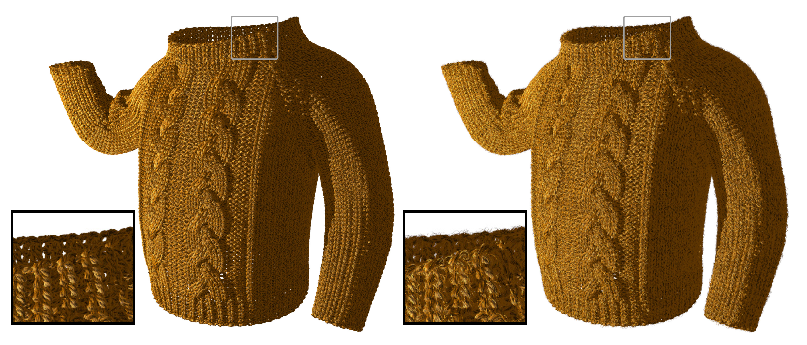

## GPU Optimization of Material Point Methods(SIGGRAPH ASIA 2018)
[[project](http://www.cs.utah.edu/~kwu)]
[[paper](http://www.cs.utah.edu/~kwu/GPU_MPM/GPU_MPM.pdf)]
[[video](https://www.youtube.com/watch?v=xTUSFn67U_I&feature=youtu.be)]
[[code](https://github.com/kuiwuchn/GPUMPM)]

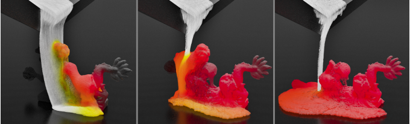

## Anisotropic Elastoplasticity for Cloth, Knit and Hair Frictional Contact(SIGGRAPH 2017)
[[project](https://www.seas.upenn.edu/~cffjiang/)]
[[paper](https://www.seas.upenn.edu/~cffjiang/research/cloth/paper.pdf)]
[[video](https://www.youtube.com/watch?v=eGtB0VXJsuI)]

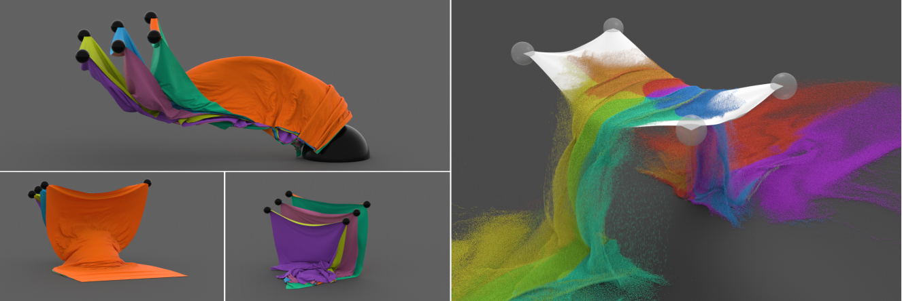

## A Multi-Scale Model for Simulating Liquid-Fabric Interactions(SIGGRAPH 2018)
[[project](http://www.cs.columbia.edu/cg/wetcloth/)]
[[paper](http://www.cs.columbia.edu/cg/wetcloth/main.pdf)]
[[video](https://www.youtube.com/watch?v=xvyGpBKevLM&feature=youtu.be)]
[[code](https://github.com/nepluno/libWetCloth)]

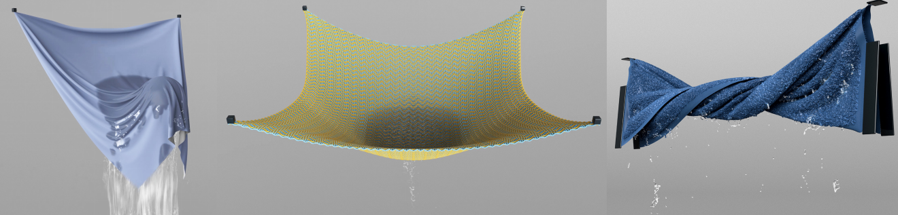

## Accurate Appearance Preserving Prefiltering for Rendering Displacement-Mapped Surfaces(SIGGRAPH 2019)
[[project](https://winmad.github.io/)]
[[paper](https://cseweb.ucsd.edu/~liw086/multires-surface-s19/multires.pdf)]
[[video](https://cseweb.ucsd.edu/~liw086/multires-surface-s19/video_appearance_filtering_final.mp4)]
[[code](https://winmad.github.io/)]

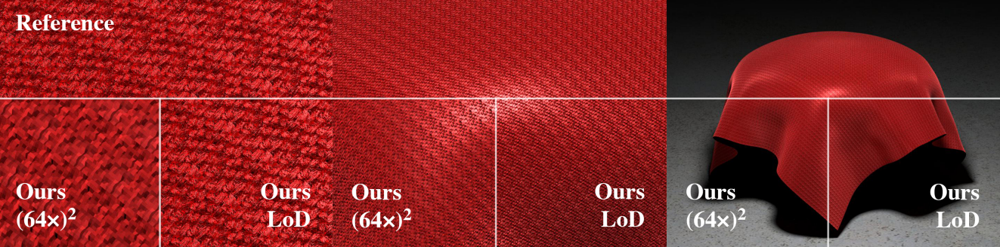

## Mechanics-Aware Modeling of Cloth Appearance
[[project](https://shuangz.com/publications.htm)]
[[paper](https://arxiv.org/abs/1904.11116)]
[[video](https://www.youtube.com/watch?v=10eD-tpFCNI&feature=youtu.be)]

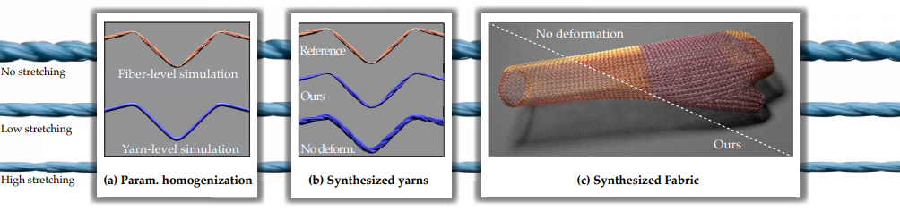

## Fiber-Level On-the-Fly Procedural Textiles(Computer Graphics Forum 2017)
[[project](http://www.cs.cornell.edu/projects/ctcloth/#proc-egsr17)]
[[paper](https://shuangz.com/projects/proccloth-egsr17/proccloth-egsr17.pdf)]
[[video](https://vimeo.com/218529473)]

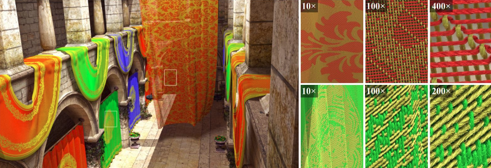

## Real-Time Linear BRDF MIP-Mapping(Computer Graphics Forum 2017)
[[paper](https://shuangz.com/projects/nmfilter-egsr17/nmfilter-main.pdf)]
[[video](https://vimeo.com/218957543)]

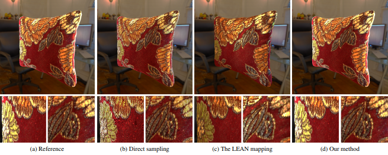

## Downsampling Scattering Parameters for Rendering Anisotropic Media(SIGGRAPH Asia 2016)
[[project](https://shuangz.com/projects/multires-sa16)]
[[paper](https://shuangz.com/projects/multires-sa16/multires-sa16.pdf)]
[[video](https://vimeo.com/182425415)]
[[code](https://shuangz.com/projects/multires-sa16)]

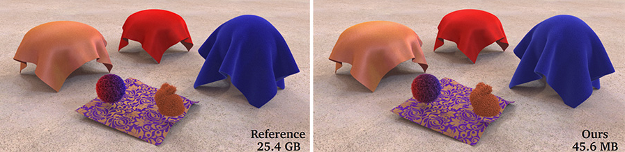

## Fitting Procedural Yarn Models for Realistic Cloth Rendering(SIGGRAPH 2016)
[[project](http://www.cs.cornell.edu/projects/ctcloth/#proc-sig15)]
[[paper](http://www.cs.cornell.edu/~kb/publications/SIG16ProceduralYarn.pdf)]
[[video](https://vimeo.com/163726370)]
[[code](http://www.cs.cornell.edu/projects/ctcloth/#proc-sig15)]

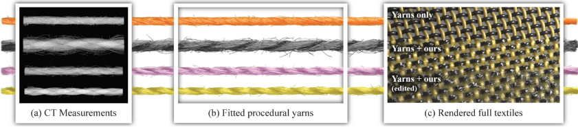

## Fast Rendering of Fabric Micro-Appearance Models Under Directional and Spherical Gaussian Lights(SIGGRAPH Asia 2017)
[[project](https://pkhungurn.github.io/)]
[[paper](http://www.cs.cornell.edu/projects/ctcloth/sa17/paper.pdf)]

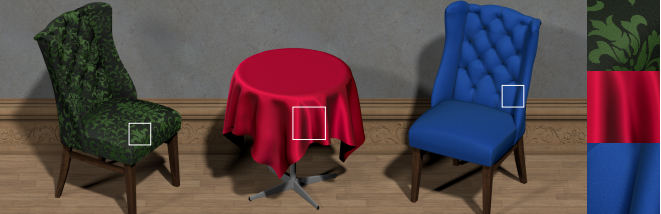

## Matching Real Fabrics with Micro-Appearance Models(TOG 2015)
[[project](http://www.cs.cornell.edu/projects/ctcloth/#matching-cloth)]
[[paper](http://www.cs.cornell.edu/projects/ctcloth/download/matching-cloth/togpaper_20150904.pdf)]
[[video](http://www.cs.cornell.edu/projects/ctcloth/download/matching-cloth/video.mp4)]

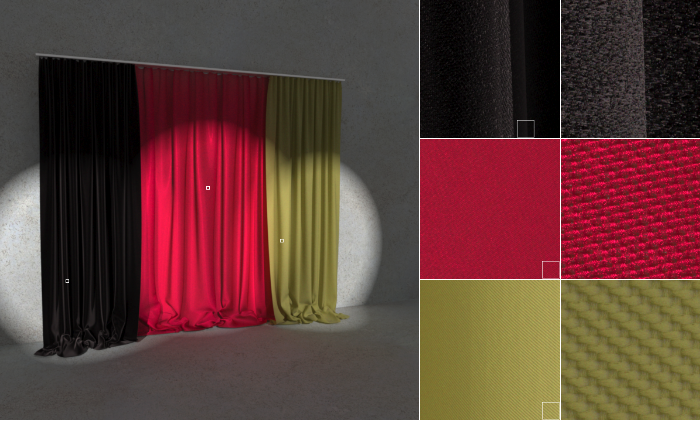

## Modular Flux Transfer: Efficient Rendering of High-Resolution Volumes with Repeated Structures(SIGGRAPH 2013)
[[project](http://www.cs.cornell.edu/projects/ctcloth/#mft-sg13)]
[[paper](http://www.cs.cornell.edu/projects/ctcloth/download/mft13/mft-sg13.pdf)]
[[video](https://vimeo.com/64120167)]

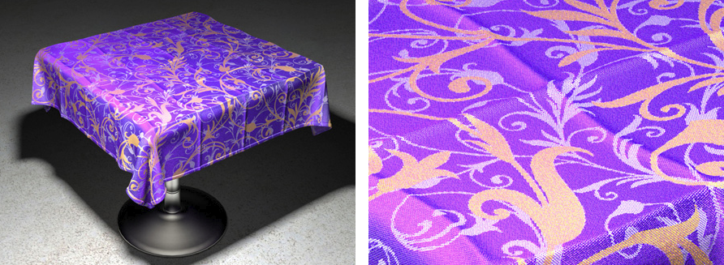

## Structure-Aware Synthesis for Predictive Woven Fabric Appearance(SIGGRAPH 2012)
[[project](http://www.cs.cornell.edu/projects/ctcloth/#ctcloth-sg12)]
[[paper](http://www.cs.cornell.edu/projects/ctcloth/download/ct12/ctcloth-sg12.pdf)]
[[video](https://vimeo.com/41508521)]
[[code](http://www.cs.cornell.edu/projects/ctcloth/#ctcloth-sg12)]

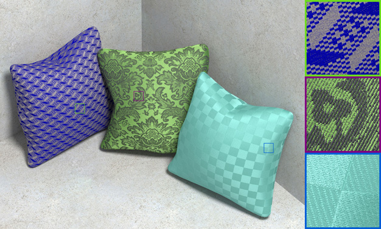

## Building Volumetric Appearance Models of Fabric using Micro CT Imaging (SIGGRAPH 2011)
[[project](http://www.cs.cornell.edu/projects/ctcloth/#ctcloth-sg11)]
[[paper](http://www.cs.cornell.edu/projects/ctcloth-sg11/download/ctcloth-sg11.pdf)]
[[video](https://vimeo.com/23132440)]

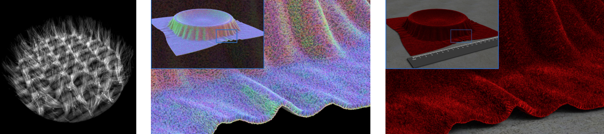
