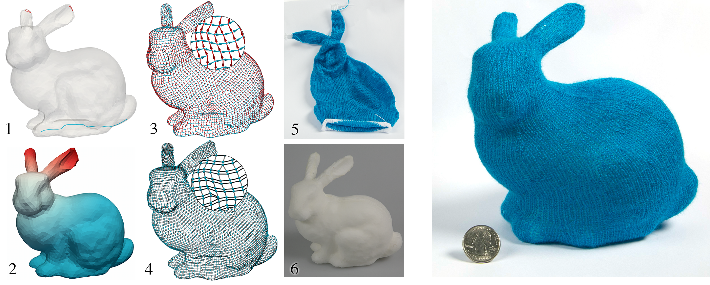

# awesome-cloth

## Visual Knitting Machine Programming(SIGGRAPH 2019)
[[project](https://textiles-lab.github.io/publications/2019-visualknit)]
[[paper](https://drive.google.com/file/d/1NtVuCF8oBdFLd0aQb4-VYmk5z1Aq4tYP)]
[[code](https://drive.google.com/file/d/1eDWzSngvJCB65TpwRn89Uc-0YEGE8oz4)]
[[video](https://drive.google.com/file/d/1WwRQp_MOyE6Ek0I3kj4WT6GGdn4tnEmE)]

## Digital Fabrication of Soft Actuated Objects by Machine Knitting(CHI 2019)
[[project](https://morphingmatter.cs.cmu.edu/machine-knitting-soft-actuation)]
[[paper](http://morphingmatter.cs.cmu.edu/~morphin5/wp-content/uploads/2019/04/soft_actuated_objects.pdf)]
[[video](https://vimeo.com/333664948)]

## Efficient Transfer Planning for Flat Knitting(ACM Symposium on Computation Fabrication 2018)
[[project](https://textiles-lab.github.io/publications/2018-flat-xfer-plan)]
[[paper](https://drive.google.com/file/d/18vG0r9QOS3atL5PABGysdzCMV7xKoKVi)]

## Automatic Machine Knitting of 3D Meshes(TOG 2018)
[[project](https://textiles-lab.github.io/publications/2018-autoknit)]
[[paper](https://drive.google.com/file/d/1UO0aGgbZqidvzgupqrJ--GwazSmIkph2)]
[[code](https://github.com/textiles-lab/autoknit)]
[[video](https://drive.google.com/file/d/1_XlprMZKhhuk89xsZMMo7Qxv801bRASK)]

## A Compiler for 3D Machine Knitting(SIGGRAPH 2016)
[[project](https://studios.disneyresearch.com/publication/machine-knitting-compiler)]
[[paper](https://s3-us-west-1.amazonaws.com/disneyresearch/wp-content/uploads/20160705213118/A-Compiler-for-3D-Machine-Knitting-Paper.pdf)]
[[video](https://www.youtube.com/watch?v=D-kpy44tB4M)]

## Woven Fabric Model Creation from a Single Image(TOG 2017)
[[paper](http://www.pismosoftware.co.uk/mashhuda/res/papers/TOG17_preprint.pdf)]

## Knittable Stitch Meshes(SIGGRAPH 2019)
[[project](http://www.cs.utah.edu/~kwu/stitchmodeling#knittable)]
[[paper](http://www.cs.utah.edu/~kwu/knittable/knittable.pdf)]
[[video](https://www.youtube.com/watch?v=9jcoREh70Bg&feature=youtu.be)]

## Stitch Meshing(SIGGRAPH 2018)
[[project](http://www.cs.utah.edu/~kwu/stitchmodeling#knittable)]
[[paper](http://www.cs.utah.edu/~kwu/stitchmeshing/stitch_meshing_final.pdf)]
[[code](https://github.com/kuiwuchn/stitchMeshing)]
[[video](http://www.cs.utah.edu/~kwu/stitchmeshing/StitchMeshRotations.mp4)]

## Real-time Cloth Rendering with Fiber-level Detail(TVCG 2017)
[[project](http://www.cs.utah.edu/~kwu/rtfr.html#rtcr)]
[[paper](http://www.cs.utah.edu/~kwu/RTFR/rtcr_lores.pdf)]
[[video](https://youtu.be/JPsA3pGYHFQ)]

## Real-time Fiber-level Cloth Rendering(I3D 2017)
[[project](http://www.cs.utah.edu/~kwu/rtfr.html#rtcr)]
[[paper](http://www.cs.utah.edu/~kwu/RTFR/rtfr.pdf)]
[[video](https://youtu.be/My4codjQRlQ)]

## GPU Optimization of Material Point Methods(SIGGRAPH ASIA 2018)
[[project](http://www.cs.utah.edu/~kwu)]
[[paper](http://www.cs.utah.edu/~kwu/GPU_MPM/GPU_MPM.pdf)]
[[video](https://www.youtube.com/watch?v=xTUSFn67U_I&feature=youtu.be)]
[[code](https://github.com/kuiwuchn/GPUMPM)]

## Anisotropic Elastoplasticity for Cloth, Knit and Hair Frictional Contact(SIGGRAPH 2017)
[[project](https://www.seas.upenn.edu/~cffjiang/)]
[[paper](https://www.seas.upenn.edu/~cffjiang/research/cloth/paper.pdf)]
[[video](https://www.youtube.com/watch?v=eGtB0VXJsuI)]

## A Multi-Scale Model for Simulating Liquid-Fabric Interactions(SIGGRAPH 2018)
[[project](http://www.cs.columbia.edu/cg/wetcloth/)]
[[paper](http://www.cs.columbia.edu/cg/wetcloth/main.pdf)]
[[code](https://github.com/nepluno/libWetCloth)]
[[video](https://www.youtube.com/watch?v=xvyGpBKevLM&feature=youtu.be)]

<!-- - Shuang Zhao
  - Fiber-Level On-the-Fly Procedural Textiles
  - Fitting Procedural Yarn Models for Realistic Cloth Rendering
  - Building Volumetric Appearance Models of Fabric using Micro CT Imaging
  
- Field-Aligned Online Surface Reconstruction 

- igl
  - Wallpaper Pattern Alignment along Garment Seams

- Implicit Untangling: A robust solution for modeling layered clothing -->
